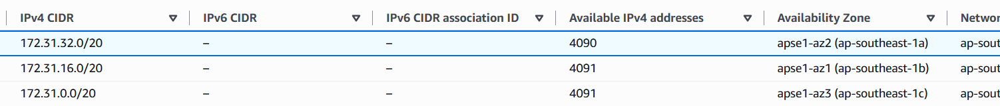
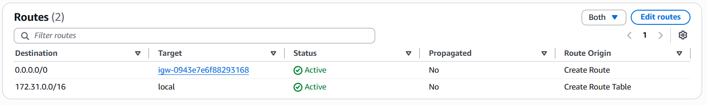
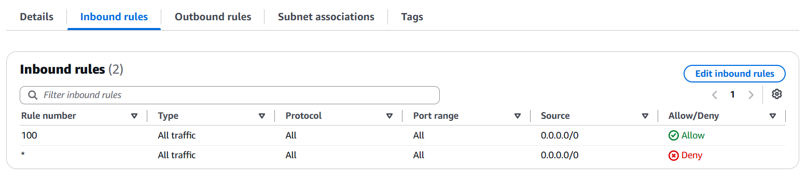
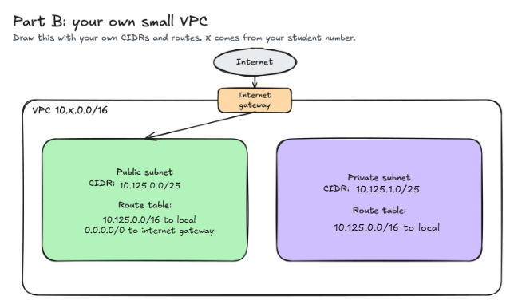

# Assignment 2 Submission

<!--
How to use this template:

1. Copy this file to submissions/assignment-2/<your-github-username>/submission.md
2. Replace every answer placeholder with your own answer. Delete the angle brackets too.
3. Save your four images in the same folder, with the exact file names below.
4. Do not write your full name or your student number in this file.
-->

## About me

- GitHub username: flaaa01
- Section: VI-CCSAD
- IAM user name that I signed in with: ccsad-g01
- X: 125

---

## Part A. Explore

### A1. The VPC

Default VPC IPv4 CIDR:

`172.31.0.0/16`

Number of addresses in that CIDR:

65,536

### A2. The subnets

| Availability Zone | IPv4 CIDR |
| --- | --- |
| apse1-az2(ap-southeast-1a) | 172.31.32.0/20 |
| apse1-az1(ap-southeast-1b) | 172.31.16.0/20 |
| apse1-az3(ap-southeast-1c) | 172.31.0.0/20 |

Screenshot 1. Save it as `screenshot-1-subnets.png` in your folder. The image line below shows it.

### A3. Available addresses

Available IPv4 addresses in each subnet:

'apse1-az2(ap-southeast-1a)' 4090 'apse1-az1(ap-southeast-1b)' 4091 'apse1-az3(ap-southeast-1c)' 4091

Why is the number lower than 4,096?

A '/20' subnet has 4,096 IPv4 addresses, but AWS reserves 5 addresses in every subnet for networking purposes. Therefore, an empty subnet normally has 4,091 available addresses.

What uses the missing address in the subnet with the lowest number?

The ap-southeast-1a subnet has 4,090 available addresses, which is one fewer than the normal 4,091. This means one additional IPv4 address is currently being used by a network interface/resource in that subnet.

### A4. The route table

| Destination | Target |
| --- | --- |
| 172.31.0.0/16 | local |
| 0.0.0.0./0 | igw-... |

Screenshot 2. Save it as `screenshot-2-routes.png` in your folder. The image line below shows it.

### A5. Public or private

Are the default subnets public or private? Which route proves it?

The default subnets are public. The route `0.0.0.0/0` to the Internet Gateway (`igw-...`) provides a path from the subnet to the internet.

### A6. The internet gateway

State of the internet gateway:

Attached

What happens to the default subnets if the gateway is detached?

If the Internet Gateway is detached, the default subnets lose their path to the internet because the `0.0.0.0/0` route can no longer reach the Internet Gateway. However, communication between resources inside the VPC can still work through the local route.

### A7. NAT gateways

Number of NAT gateways:

0

Can a server in a new private subnet download updates? Why?

No. There are no NAT gateways in the VPC, so a server in a private subnet would not have a NAT gateway to provide outbound internet access. It would need a NAT gateway and a route such as `0.0.0.0/0` pointing to that NAT gateway.

### A8. The network ACL

| Rule number | Source | Allow or Deny |
| --- | --- | --- |
| 100 | 0.0.0.0/0 | Allow |
| * | 0.0.0.0/0 | Deny |

How is a network ACL different from a security group?

A network ACL controls traffic for an entire subnet, while a security group controls traffic for individual resources such as EC2 instances. A network ACL is stateless, so inbound and outbound traffic are evaluated separately, while a security group is stateful. A network ACL can also explicitly deny traffic.

Screenshot 3. Save it as `screenshot-3-network-acl.png` in your folder. The image line below shows it.

### A9. The default security group

Inbound rule (type and source):

All traffic source: sg-...

Which resources can send traffic to an instance that uses it?

Resources that are associated with the same default security group can send inbound traffic to the instance. Resources that are not using that security group are not allowed by this inbound rule.

---

## Part B. Prepare

### B1. Plan two subnets

- Public subnet CIDR: <answer>
- Private subnet CIDR: <answer>

### B2. Route tables

Route table of the public subnet:

| Destination | Target |
| --- | --- |
| <answer> | <answer> |
| <answer> | <answer> |

Route table of the private subnet:

| Destination | Target |
| --- | --- |
| <answer> | <answer> |

### B3. My VPC diagram

Tool used (Excalidraw, draw.io, Lucidchart, or paper):

<answer>

Save your diagram as `vpc-diagram.png` in your folder. The image line below shows it.

### B4. Predict a change

Can you still open the web page from your laptop? Why?

<answer>

Can the instance still reach another instance in the VPC? Why?

<answer>

### B5. Place a database

Which subnet gets the database? Why?

<answer>

### B6. My question about VPCs

What is your question, and what made you think of it?

<answer>
